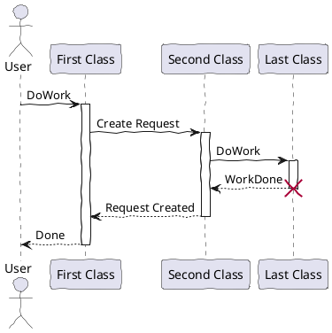

```puml
@startuml
skinparam handwritten true

actor User
participant "First Class" as A
participant "Second Class" as B
participant "Last Class" as C

User -> A ++ : DoWork

A -> B ++: Create Request

B -> C ++: DoWork
C --> B : WorkDone
destroy C

B --> A -- : Request Created

A --> User --: Done

@enduml
```

