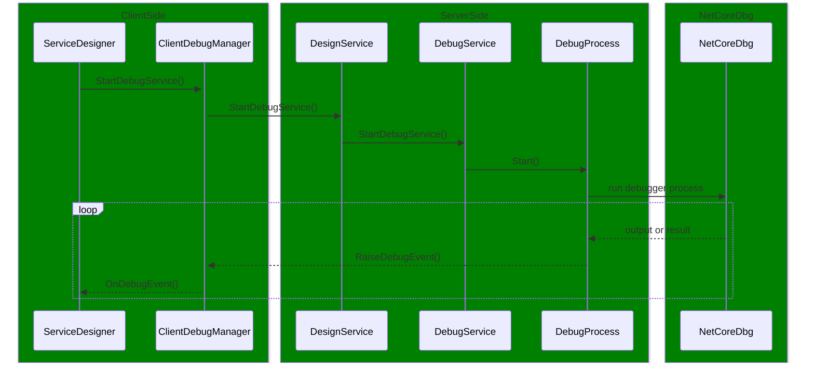

MI协议调试输出示例:

```shell
(gdb)
-var-create v1 ds
^done,name="v1",value="{AppBoxCore.DataTable}",attributes="editable",exp="ds",numchild="14",type="AppBoxCore.DataTable",thread-id="3272908"
(gdb)
-var-evaluate-expression v1
^done,value="{AppBoxCore.DataTable}"
(gdb)
-var-list-children v1
^done,numchild="14",children=[child={name="var2",attributes="editable",exp="_removedRows",numchild="1",type="System.Collections.Generic.List<AppBoxCore.DataRow>",thread-id="3773427"},child={name="var3",attributes="editable",exp="RemovedRows",numchild="0",type="System.Collections.Generic.IList<AppBoxCore.DataRow>",thread-id="3773427"},child={name="var4",attributes="editable",exp="Columns",numchild="3",type="AppBoxCore.DataColumn[]",thread-id="3773427"},child={name="var5",attributes="editable",exp="EntityModelId",numchild="5",type="AppBoxCore.ModelId",thread-id="3773427"},child={name="var6",attributes="editable",exp="items",numchild="13",type="System.Collections.Generic.List<AppBoxCore.DataRow>",thread-id="3773427"},child={name="var7",attributes="editable",exp="Count",numchild="0",type="int",thread-id="3773427"},child={name="var8",attributes="editable",exp="Items",numchild="13",type="System.Collections.Generic.List<AppBoxCore.DataRow>",thread-id="3773427"},child={name="var9",attributes="editable",exp="Item",numchild="26",type="System.Reflection.TargetParameterCountException",thread-id="3773427"},child={name="var10",attributes="editable",exp="System.Collections.Generic.ICollection<T>.IsReadOnly",numchild="0",type="bool",thread-id="3773427"},child={name="var11",attributes="editable",exp="System.Collections.ICollection.IsSynchronized",numchild="0",type="bool",thread-id="3773427"},child={name="var12",attributes="editable",exp="System.Collections.ICollection.SyncRoot",numchild="13",type="System.Collections.Generic.List<AppBoxCore.DataRow>",thread-id="3773427"},child={name="var13",attributes="editable",exp="System.Collections.IList.Item",numchild="26",type="System.Reflection.TargetParameterCountException",thread-id="3773427"},child={name="var14",attributes="editable",exp="System.Collections.IList.IsReadOnly",numchild="0",type="bool",thread-id="3773427"},child={name="var15",attributes="editable",exp="System.Collections.IList.IsFixedSize",numchild="0",type="bool",thread-id="3773427"}],has_more="0"
```