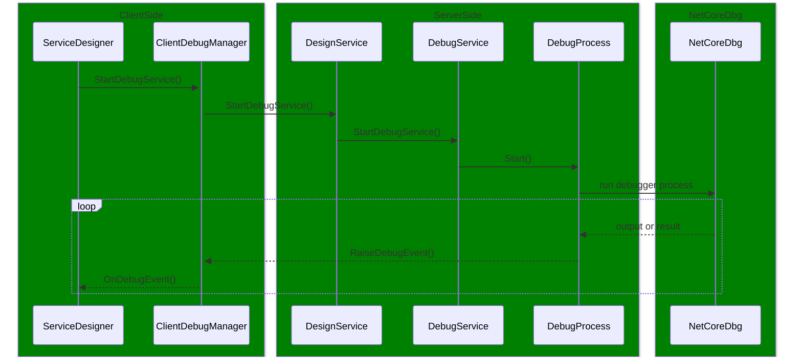

```mermaid
sequenceDiagram
box Green ClientSide
participant ServiceDesigner
participant ClientDebugManager
end

box Green ServerSide
participant DesignService
participant DebugService
participant DebugProcess
end

box Green NetCoreDbg
participant NetCoreDbg
end

ServiceDesigner->>+ClientDebugManager: StartDebugService()
ClientDebugManager->>DesignService: StartDebugService()
DesignService->>DebugService: StartDebugService()
DebugService->>DebugProcess: Start()
DebugProcess->>NetCoreDbg: run debugger process
loop
    NetCoreDbg-->>DebugProcess: output or result
    DebugProcess-->>ClientDebugManager: RaiseDebugEvent()
    ClientDebugManager-->>ServiceDesigner: OnDebugEvent()
end
```