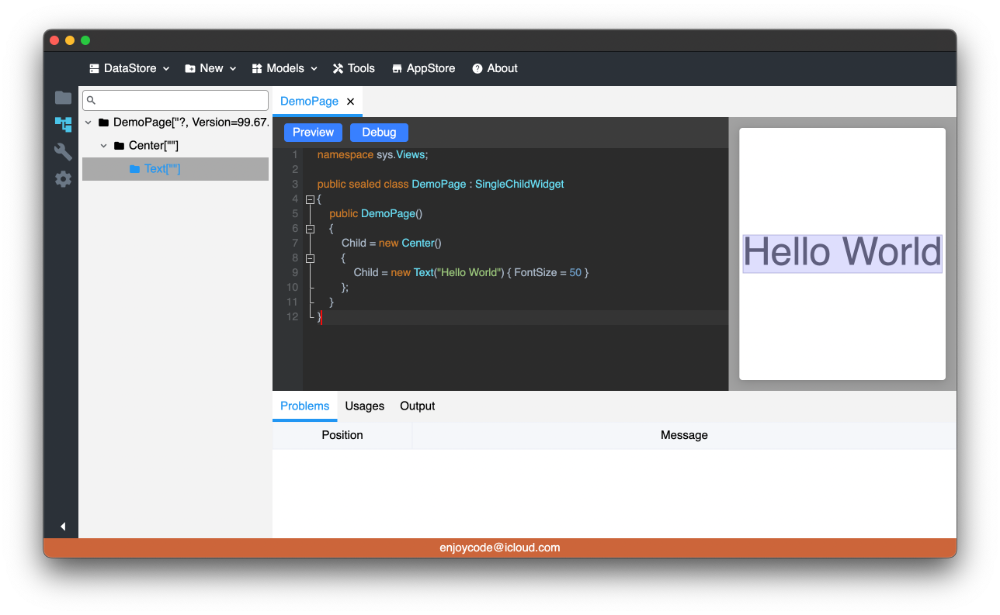

# 序

作者一直在信息化领域深耕，涉及包括Web端、桌面端、移动端等各类前端技术，深受这些前端技术的苦，主要但不限于：

1. 每种技术编写代码的语言及技术完全不同，同样呈现形式的组件各端无法通用；
2. 大部分前端开发语言跟后端开发语言不同，不能共用一些数据结构；

前端UI的本质是在显示器上呈现由像素点组成的画面，并且响应外部输入事件作出相应的重绘。由于作者对Skia2D绘图引擎比较熟悉，又恰好可以借鉴一下Flutter引擎的跨端实现，所以作者动起了重新造一个跨端UI的念头。 阿基米德说过：“给我一个支点，我可以撬动地球”，那作者要说：给我一块画布，我来创造一个全新的跨端UI。

# 一、画布 Canvas:
有了画布才能绘制用户界面，目前画布的来源主要是两类：

1. Web端参考Flutter的实现，利用编译为WebAssembly的CanvasKit提供；
2. 桌面端及移动端参考Xamarin的实现，利用原生操作系统的视窗结合Skia的SkCanvas提供;

绘制引擎暂统一由Skia来处理，将来可能会考虑抽象绘制引擎。

# 二、组件树 Widget Tree
Flutter有三棵树，作者嫌啰嗦所以只有一棵树，好处是实现简单且方便维持组件实例的状态。每个界面都由组件树结构组成。

# 三、组件状态 State
