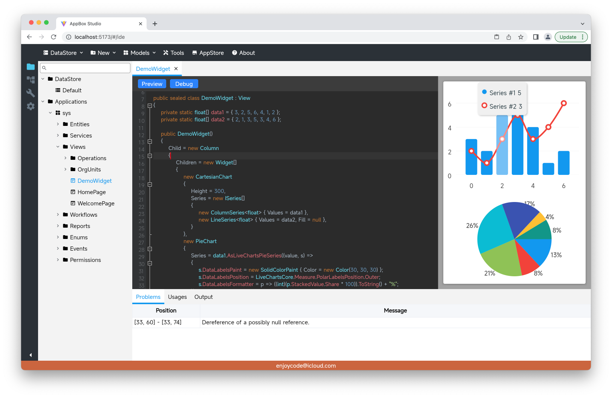

# 一、源起

&emsp;&emsp;作者是名超大龄程序员，曾涉及了包括Web端、桌面端、移动端等各类前端技术，深受这些前端技术的苦，主要但不限于：

1. 每种技术编写代码的语言及技术完全不同，同样呈现形式的组件各端无法通用；
2. 大部分前端开发语言跟后端开发语言不同，不能共用一些数据结构；

&emsp;&emsp;前端UI的本质是在显示器上呈现由像素点组成的画面，并且响应外部输入事件作出相应的重绘。由于作者对Skia2D绘图引擎比较熟悉，又恰好可以借鉴一下Flutter引擎的跨端实现，所以作者动起了重新造一个跨端UI的念头。 阿基米德说过：“给我一个支点，我可以撬动地球”，那作者要说："给我一块画布，我可以造一个全新的跨端UI"。

# 二、画布及画笔:
&emsp;&emsp;有了画布才能绘制用户界面，目前画布的来源主要是两类：

1. Web端参考Flutter的实现，利用编译为WebAssembly的CanvasKit提供；
2. 桌面端及移动端参考Xamarin的实现，利用原生操作系统的视窗结合Skia的SkCanvas提供;

&emsp;&emsp;每个窗体的画布分为两层，一层绘制Widget，另一层用于弹出层的绘制及一些组件装饰器的绘制。绘制引擎暂统一由Skia来处理，将来可能会考虑抽象绘制引擎。

# 三、组件树、布局及样式
&emsp;&emsp;Flutter有三棵树，作者嫌啰嗦所以只有一棵WidgetTree，好处是实现简单且方便维持组件实例的状态。每个界面都由组件树结构组成。有些组件为布局类的（eg: Column、Stack等），具备单或多子组件；有些组件为叶子节点(eg: Text、PieChart等)，通过设置相应的属性后直接绘制至画布。


# 四、组件状态
&emsp;&emsp;实现组件时如果需要外部状态驱动，可以定义状态变量并绑定至组件的相关属性，这样当状态值发生变更时，绑定的组件根据状态影响进行重新布局或仅重新绘制。

```c#
public class DemoCounter : View 
{
    private readonly State<int> _counter = 0; //定义状态
    
    public DemoCounter() 
    {
        Child = new Column
        {
            Children =
            {
                new Text(_counter.AsStateOfString()/*绑定至组件*/),
                new Button("+") { OnTap = e => _counter.Value+=1/*改变状态值*/ }
            }
        };
    }
}
```

# 五、组件动画
&emsp;&emsp;动画实现基本照搬Flutter的实现方式，由AnimationController在指定时间段内驱动各Animation的动画值变化，从而连续改变组件的状态值。

```c#
public class DemoAnimation : View
{
    private readonly AnimationController _controller;
    private readonly Animation<Offset> _offsetAnimation;
    
    public DemoAnimation()
    {
        _controller = new AnimationController(1000/*动画时长*/);
        _offsetAnimation = new OffsetTween(new Offset(-1, 0), new Offset(1, 0))
            .Animate(_controller); //位移变换并绑定至动画控制器
        
        Child = new Column
        {
            Children =
            {
                new Button("播放动画") { OnTap = e => _controller.Forward() },
                new SlideTransition(_offsetAnimation)
                {
                    Child = new Text("动画")
                }
            }
        };
    }
}
```


# 六、后续
&emsp;&emsp;力量有限，在此抛砖引玉希望更多感兴趣的伙伴加入完善，也希望成为跟华为ArkUI类似的国产UI，对了暂时就叫PixUI吧。