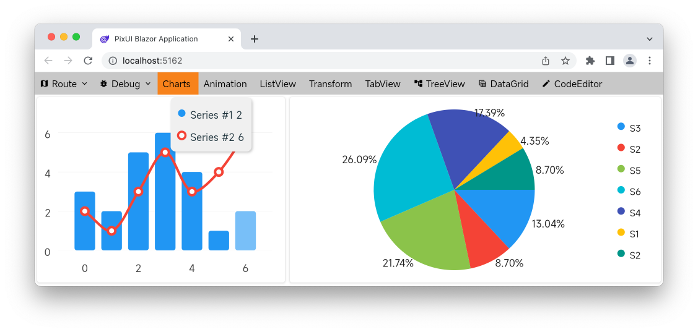
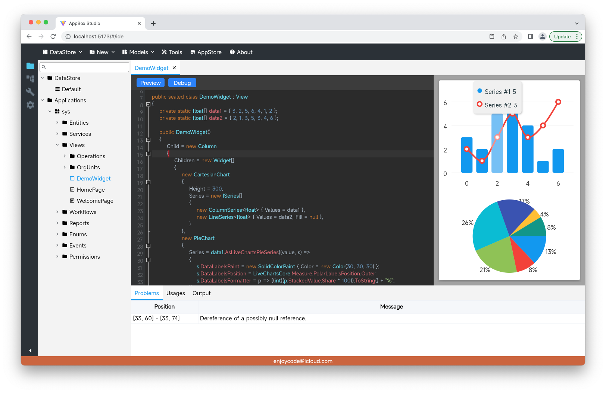

&emsp;&emsp;作者之前介绍了开发中的PixUI，为了适配Web应用采用了将C#通过Roslyn语法语义分析后转换为Javascript的方案，但是这样带来的问题是工程量较大，在短时间内无法达到生产级质量。因此在简单评估了Blazor技术后决定暂使用Blazor WebAssembly来实现PixUI的Web端。本文记录一些Blazor链接原生(C/C++)库过程中所踩过的坑，同时为了庆祝儿子考完10年内最难中考提前宣布PixUI正式开放源码，基本概念介绍请参考上一篇。

> PixUI源码: https://github.com/enjoycode/PixUI
> 
> 请先安装 dotnet workload install wasm-tools
> 
> 打开PixUI.sln运行PixUI.Platform.Blazor项目

# 坑一: 原生函数返回结构体无法编译链接的问题
&emsp;&emsp;示例C结构体与函数定义如下：
```c++
typedef struct {
  uint32_t x;
  uint32_t y;
} CPoint;

CPoint get_point(); //返回结构体
```
此时C#封装的Api调用上述函数在Blazor WebAssembly链接时会报错，需要包装原生函数如下:
```c++
void get_point_wasm(CPoint* cpoint);
```
对应的C# Api代码为:
```csharp
public struct CPoint {
    public uint x;
    public uint y;
}

[LibraryImport("nativeLibName")]
public static partial unsafe void get_point_wasm(CPoint* cpoint);
```

# 坑二: 原生函数回调C#方法的问题
&emsp;&emsp;C#的回调方法必须是静态方法，同时标上UnmanagedCallersOnly特性，且参数不能有结构体（可以用结构体指针代替），示例如下：
```csharp
[UnmanagedCallersOnly]
public static unsafe void Callback(CPoint* cpoint) { /*...*/ }
```
&emsp;&emsp;在将C#回调方法封送给原生函数时参考如下示例，注意因Blazor WebAssembly的Bug，回调地址只能是IntPtr类型:
```csharp
var callbackPtr = (IntPtr)(delegate* unmanaged<void, CPoint*>)&Callback;
c_api(callbackPtr); //将回调地址封送给原生函数
```

# 坑三: Unicode库ICU4C的问题
&emsp;&emsp;因Blazor WebAssembly生成的icudt.dat文件不包含skia库需要的一些Feature（比如：分词、换行等)，所以需要参考https://github.com/dotnet/icu.git自己定义并重新生成该数据文件，并且配置Blazor项目替换相应的数据文件。

# 小结
&emsp;&emsp;最后预告一下使用PixUI开发中的低代码快速开发框架AppBox，通过内置的开发环境将传统应用开发过程中的数据结构、业务逻辑、用户界面等抽象为模型，组合模型形成完整的应用。

&emsp;&emsp;力量有限，欢迎感兴趣的小伙伴加入共同完善！