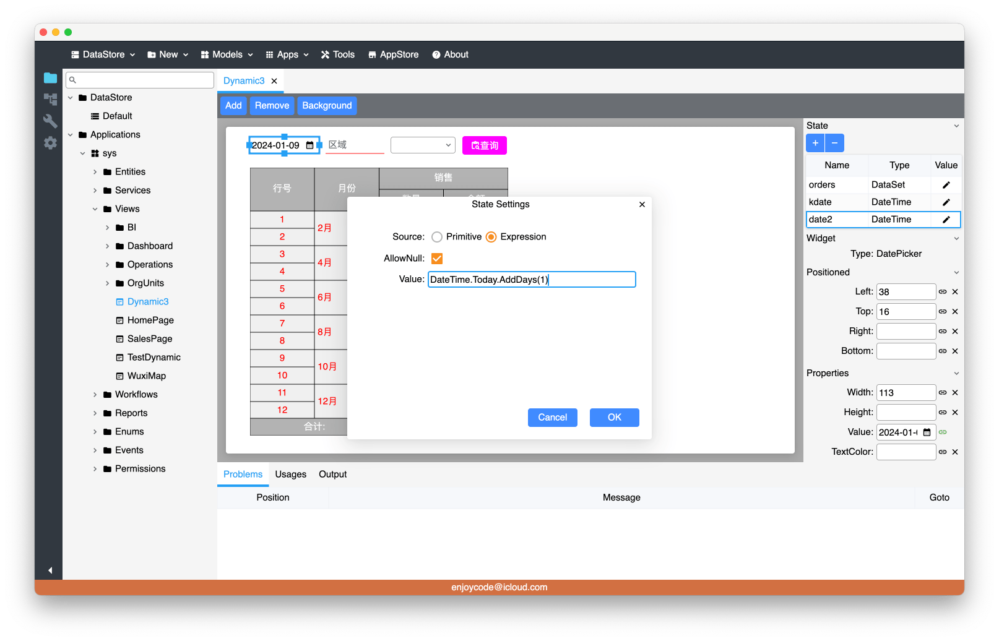

&emsp;&emsp;最近框架中的可视化界面设计需要使用到表达式引擎(解析代码字符串并动态执行)，之前旧框架的实现是将表达式字符串解析为语法树后解释执行该表达式，本文介绍如何使用Roslyn解析表达式字符串，并直接转换为Linq的表达式后编译执行。

# 一、语法(Syntax)与语义(Semantic)

&emsp;&emsp;C#的代码通过Roslyn解析为相应的语法树，并且利用语义分析可以获取语法节点所对应的符号及类型信息，这样利用这些信息可以正确的转换为Linq的表达式。这里作者就不展开了，可以参考Roslyn文档。

* 语法分析
https://learn.microsoft.com/en-us/dotnet/csharp/roslyn-sdk/get-started/syntax-analysis
* 语义分析
https://learn.microsoft.com/en-us/dotnet/csharp/roslyn-sdk/get-started/semantic-analysis
* 语法转换
https://learn.microsoft.com/en-us/dotnet/csharp/roslyn-sdk/get-started/syntax-transformation


# 二、实现表达式解析器(ExpressionParser)

## 1. 解析字符串方法
&emsp;&emsp;下面开始创建一个类库工程，引用包Microsoft.CodeAnalysis.CSharp.Features，然后参照以下代码创建ExpressionParser类, 静态ParseCode()方法是解析字符串表达式的入口:

```csharp
using System.Linq.Expressions;
using Microsoft.CodeAnalysis;
using Microsoft.CodeAnalysis.CSharp;
using Microsoft.CodeAnalysis.CSharp.Syntax;

namespace ExpEngine;

public sealed class ExpressionParser : CSharpSyntaxVisitor<Expression>
{
    private ExpressionParser(SemanticModel semanticModel)
    {
        _semanticModel = semanticModel;
    }

    private readonly SemanticModel _semanticModel;

    /// <summary>
    /// 解析表达式字符串转换为Linq的表达式
    /// </summary>
    public static Expression ParseCode(string code)
    {
        var parseOptions = new CSharpParseOptions().WithLanguageVersion(LanguageVersion.CSharp11);
        var compilationOptions = new CSharpCompilationOptions(OutputKind.DynamicallyLinkedLibrary)
            .WithNullableContextOptions(NullableContextOptions.Enable);

        var tree = CSharpSyntaxTree.ParseText(code, parseOptions);
        var root = tree.GetCompilationUnitRoot();
        var compilation = CSharpCompilation.Create("Expression", options: compilationOptions)
            .AddReferences(MetadataReference.CreateFromFile(typeof(string).Assembly.Location))
            .AddSyntaxTrees(tree);
        var semanticModel = compilation.GetSemanticModel(tree);
        //检查是否存在语义错误
        var diagnostics = semanticModel.GetDiagnostics();
        var errors = diagnostics.Count(d => d.Severity == DiagnosticSeverity.Error);
        if (errors > 0)
            throw new Exception("表达式存在语义错误");

        var methodDecl = root.DescendantNodes().OfType<MethodDeclarationSyntax>().First();
        if (methodDecl.Body != null && methodDecl.Body.Statements.Count > 1)
            throw new NotImplementedException("Parse block body");

        if (methodDecl.ExpressionBody != null)
            throw new NotImplementedException("Parse expression body");

        var firstStatement = methodDecl.Body!.Statements.FirstOrDefault();
        if (firstStatement is not ReturnStatementSyntax returnNode)
            throw new Exception("表达式方法不是单行返回语句");

        var parser = new ExpressionParser(semanticModel);
        return parser.Visit(returnNode.Expression)!;
    }
}
```

## 2. 解析运行时类型的方法
&emsp;&emsp;因为转换过程中需要将Roslyn解析出来的类型信息转换为对应的C#运行时的类型，所以需要实现类型转换的方法：

```csharp
    private readonly Dictionary<string, Type> _knownTypes = new()
    {
        { "bool", typeof(bool) },
        { "byte", typeof(byte) },
        { "sbyte", typeof(sbyte) },
        { "short", typeof(short) },
        { "ushort", typeof(ushort) },
        { "int", typeof(int) },
        { "uint", typeof(uint) },
        { "long", typeof(long) },
        { "ulong", typeof(ulong) },
        { "float", typeof(float) },
        { "double", typeof(double) },
        { "char", typeof(char) },
        { "string", typeof(string) },
        { "object", typeof(object) },
    };

    /// <summary>
    /// 根据类型字符串获取运行时类型
    /// </summary>
    private Type ResolveType(string typeName)
    {
        if (_knownTypes.TryGetValue(typeName, out var sysType))
            return sysType;

        //通过反射获取类型
        var type = Type.GetType(typeName);
        if (type == null)
            throw new Exception($"Can't find type: {typeName} ");

        return type;
    }
```

## 3. 解析各类语法节点转换为对应的Linq表达式
&emsp;&emsp;这里举一个简单的LiteralExpression转换的例子，其他请参考源码。需要注意的是Linq的表达式严格匹配类型签名，比如方法调用object.Equals(object a, object b), 如果参数a是int类型，需要使用Expression.Convert(int, typeof(object))转换为相应的类型。

```csharp
    private Type? GetConvertedType(SyntaxNode node)
    {
        var typeInfo = _semanticModel.GetTypeInfo(node);
        Type? convertedType = null;
        if (!SymbolEqualityComparer.Default.Equals(typeInfo.Type, typeInfo.ConvertedType))
            convertedType = ResolveType((INamedTypeSymbol)typeInfo.ConvertedType!);

        return convertedType;
    }

    public override Expression? VisitLiteralExpression(LiteralExpressionSyntax node)
    {
        var convertedType = GetConvertedType(node);
        var res = Expression.Constant(node.Token.Value);
        return convertedType == null ? res : Expression.Convert(res, convertedType);
    }
```

# 三、测试解析与执行表达式
&emsp;&emsp;现在可以创建一个单元测试项目验证一下解析字符串表达式并执行了，当然实际应用过程中应缓存解析并编译的表达式委托:

```csharp
namespace UnitTests;

using static ExpEngine.ExpressionParser;

public class Tests
{
    [Test]
    public void StaticPropertyTest() => Assert.True(Run<object>("DateTime.Today") is DateTime);

    [Test]
    public void InstancePropertyTest() => Run<int>("DateTime.Today.Year");

    [Test]
    public void MethodCallTest1() => Run<DateTime>("DateTime.Today.AddDays(1 + 1)");

    [Test]
    public void MethodCallTest2() => Run<DateTime>("DateTime.Today.AddDays(DateTime.Today.Year)");

    [Test]
    public void MethodCallTest3() => Run<DateTime>("DateTime.Today.AddDays(int.Parse(\"1\"))");

    [Test]
    public void MethodCallTest4() => Assert.True(Run<bool>("Equals(new DateTime(1977,3,1), new DateTime(1977,3,1))"));

    [Test]
    public void PrefixUnaryTest() => Run<DateTime>("DateTime.Today.AddDays(-1)");

    [Test]
    public void NewTest() => Assert.True(Run<DateTime>("new DateTime(1977,3,16)") == new DateTime(1977, 3, 16));

    [Test]
    public void BinaryTest1() => Assert.True(Run<float>("3 + 2.6f") == 3 + 2.6f);

    [Test]
    public void BinaryTest2() => Assert.True(Run<bool>("3 >= 2.6f"));
}
```

# 四、 一些限制与TODO
&emsp;&emsp;Linq的表达式本身存在一些限制，请参考文档:
https://learn.microsoft.com/en-us/dotnet/csharp/advanced-topics/expression-trees/

&emsp;&emsp;另上述代码仅示例，比如表达式输入参数等未实现，小伙伴们可以继续自行完善。
