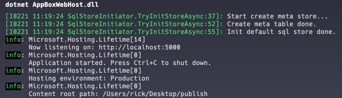
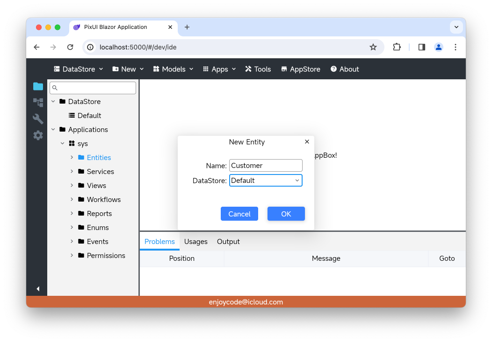
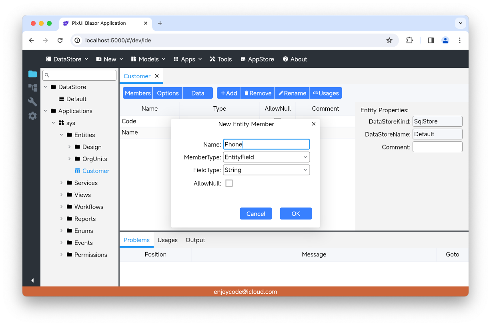
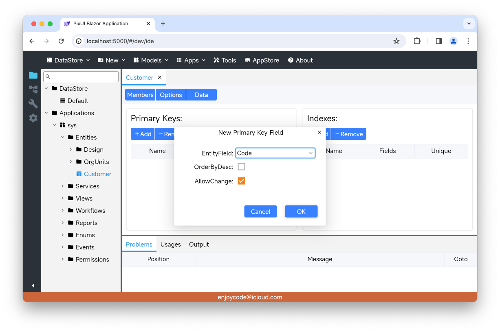
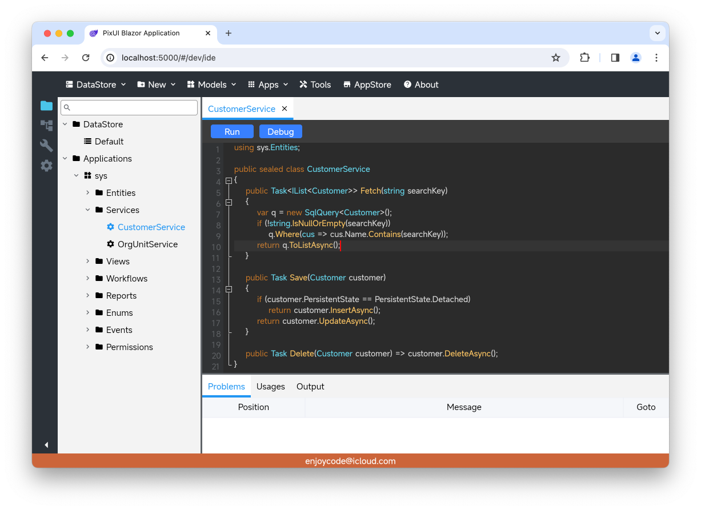
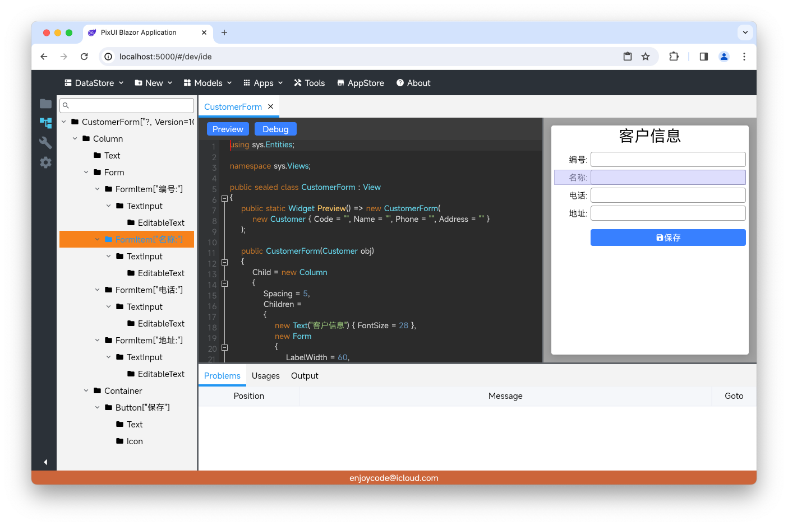
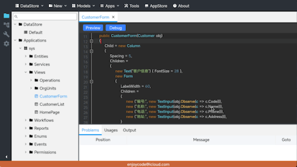
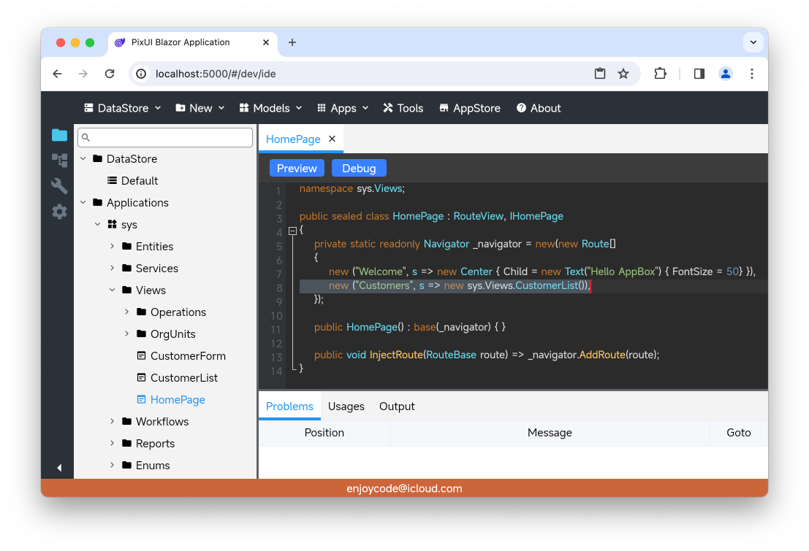
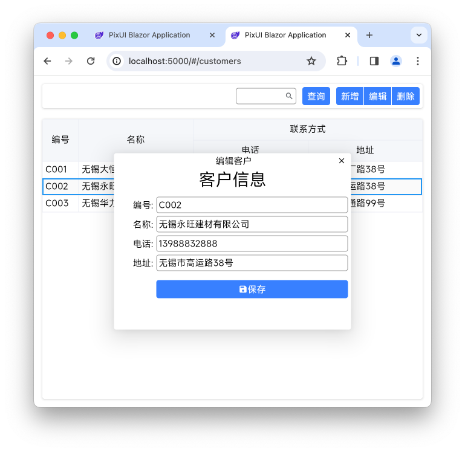

<style>
pre {
  overflow-y: auto;
  max-height: 300px;
}
</style>

&emsp;&emsp;目前很多低代码平台都是基于Web用拖拽方式生成界面，确实可以极大的提高开发效率，但也存在一些问题：
1. 大部分平台灵活性不够，特殊需求需要较大的自定义开发；
2. 解析json配置的执行效率不是太高；
3. 大部分平台缺乏后端支持或复杂的业务逻辑支持；
4. 与后端的数据结构及业务服务不存在强关联，修改后端容易造成前端配置失效；
5. 大部分平台缺乏移动端及桌面端支持；

&emsp;&emsp;作者通过不断尝试及多年的经验积累创建了AppBox项目，一个快速开发框架，其将应用系统所涉及的数据结构、业务逻辑、用户界面、工作流、报表、权限等抽象为各类型的模型，通过组合模型形成完整的应用系统，也可以在线修改模型以适应业务的需求变更。 由于模型具备规范性和关联性约束，这样可以高效的分析模型间的关系，并减少因修改模型时引入新的缺陷。本文以客户信息管理作为示例简单介绍使用AppBox的开发流程，以便小伙伴们能够快速了解本框架。

# 一、运行前准备

* 准备一个空的数据库，目前仅支持PostgreSql；
* 克隆仓库`git clone --recurse-submodules https://github.com/enjoycode/AppBox.git`
* 编译发布WebHost项目；
* 编译发布BlazorApp项目，并将发布目录内的wwwroot文件夹复制到WebHost的发布目录内；
* 修改WebHost目录内的`appsettings.json`文件中的数据库链接；
* 终端进入WebHost的发布目录，执行`dotnet AppBoxWebHost.dll`，首次执行会初始化数据库并创建一些内置的模型（如下图所示）；
  
* 打开浏览器输入开发环境入口 `localhost:5000/#/dev` ，登录用户名: `Admin` 密码: `760wb`

> 懒得编译请加作者微信或邮件直接发打包好的（本想用GitHub Release打包，但超过大小限制）

# 二、创建实体模型
&emsp;&emsp;实体模型用于描述数据结构，可映射存储至指定数据库，也可以不映射至数据库（DTO）。参考下图先选择模型树的Applications->sys->Entities文件夹，然后点击顶部主菜单的New->Entity，在弹出的对话框内输入实体名称"Customer"并选择映射的数据库"Default"。


&emsp;&emsp;在实体设计器的工具条点击"Add"按钮添加实体成员，其中MemberType(成员类型)中的EntityField代表字段，EntityRef代表一对一引用，EntitySet代表一对多引用。


&emsp;&emsp;点击实体设计器工具条点击"Options"按钮切换至选项面板，用于设置实体的主键及索引。


&emsp;&emsp;上述操作完成后，点击主菜单Models->Save保存当前模型，并且点击Models->Publish发布当前实体模型，发布过程中会在数据库创建对应的数据表。

# 三、创建服务模型
&emsp;&emsp;服务模型以伪代码的形式提供具体的业务逻辑服务，通过主菜单New->Service创建服务模型，并参考下图输入增删改查的方法。同样在操作完成后，点击主菜单Models->Save保存当前模型，并且点击Models->Publish发布当前模型，发布过程中会将伪代码转换为真正的运行时代码并编译为服务插件备用。


# 四、创建视图模型
&emsp;&emsp;视图模型有两种形式：一种是拖拽方式生成json配置并渲染的界面，适用于快速配置如大屏页面及简单的增删改查页面；另一种是代码的形式描述用户界面，百分百灵活且经过编译后运行性能高。这里只介绍代码形式，通过主菜单New->View新建视图模型，新建对话框的类型选择"Code"方式，参考以下代码分别建立一个表单视图及一个列表视图，并且保存发布。

* CustomerForm视图
```csharp
using sys.Entities;

namespace sys.Views;

public sealed class CustomerForm : View
{
    public static Widget Preview() => new CustomerForm(
        new Customer { Code = "", Name = "", Phone = "", Address = "" }
    );

    public CustomerForm(Customer obj)
    {
        Child = new Column
        {
            Spacing = 5,
            Children = 
            {
                new Text("客户信息") { FontSize = 28 },
                new Form
                {
                    LabelWidth = 60,
                    Children =
                    {
                        new ("编号:", new TextInput(obj.Observe(c => c.Code))),
                        new ("名称:", new TextInput(obj.Observe(c => c.Name))),
                        new ("电话:", new TextInput(obj.Observe(c => c.Phone))),
                        new ("地址:", new TextInput(obj.Observe(c => c.Address))),
                    }
                },
                new Container
                {
                    Padding = EdgeInsets.Only(70, 0, 5, 0),
                    Child = new Button("保存", MaterialIcons.Save)
                    {
                        Width = float.MaxValue,
                        OnTap = _ => Save(obj),
                    }
                },
            }
        };
    }
    
    private async void Save(Customer obj)
    {
        try
        {
            await sys.Services.CustomerService.Save(obj);
            obj.AcceptChanges();
            Notification.Success("保存成功!");
        }
        catch (Exception ex)
        {
            Notification.Error($"保存失败: {ex.Message}");
        }
    }
}
```

* CustomerList视图
```csharp
using sys.Entities;

namespace sys.Views;

public sealed class CustomerList : View
{
    public CustomerList()
    {
        Padding = EdgeInsets.All(10);
        Child = new Column
        {
            Spacing = 10,
            Children =
            {
                new Card { Padding = EdgeInsets.All(5), Child = BuildHeader() },
                new Card { Child = BuildBody() }
            }
        };
    }

    private readonly State<string> _searchKey = "";
    private readonly DataGridController<Customer> _dgController = new();

    private Widget BuildHeader() => new Row
    {
        Height = 30,
        Spacing = 10,
        Children =
        {
            new Expanded(),
            new TextInput(_searchKey) { Width = 100, Suffix = new Icon(MaterialIcons.Search) },
            new Button("查询") { OnTap = _ => Fetch() },
            new ButtonGroup
            {
                Children =
                {
                    new Button("新增") { OnTap = _ => OnCreate() },
                    new Button("编辑") { OnTap = _ => OnEdit() },
                    new Button("删除") { OnTap = _  => OnDelete() }
                }
            }
        }
    };

    private Widget BuildBody() => new Expanded(new DataGrid<Customer>(_dgController)
    {
        Columns =
        {
            new DataGridTextColumn<Customer>("编号", t => t.Code) { Width = 60 },
            new DataGridTextColumn<Customer>("名称", t => t.Name),
            new DataGridGroupColumn<Customer>("联系方式")
            {
                Children =
                {
                    new DataGridTextColumn<Customer>("电话", t => t.Phone),
                    new DataGridTextColumn<Customer>("地址", t => t.Address),
                }
            }
         }
    });

    protected override void OnMounted() => Fetch();

    private async void Fetch()
    {
        try
        {
            var list = await sys.Services.CustomerService.Fetch(_searchKey.Value);
            _dgController.DataSource = list;
            _dgController.TrySelectFirstRow();
        }
        catch (Exception ex)
        {
            Notification.Error($"查询客户列表失败: {ex.Message}");
        }
    }

    private void OnCreate() => Dialog.Show("新建客户",
        d => new CustomerForm(new Customer { Code = "", Name = "", Phone = "", Address = "" }
    ));

    private void OnEdit()
    {
        var obj = _dgController.CurrentRow;
        if (obj == null) return;
        Dialog.Show("编辑客户", d => new CustomerForm(obj));
    }

    private async void OnDelete()
    {
        var obj = _dgController.CurrentRow;
        if (obj == null) return;
        try
        {
            await sys.Services.CustomerService.Delete(obj);
            Fetch();
        }
        catch (Exception ex)
        {
            Notification.Error($"删除客户失败: {ex.Message}");
        }
    }
}
```

> Tip1: 可以点击视图模型编辑器上方工具条的"Preview"按钮实时预览效果，也可以点击左侧工具栏的大纲按钮查看预览视图的组件树及其布局，如下图所示：
> 
> 

> Tip2: 另外可以在代码编辑器内光标位置右键菜单选择"Goto Definition"跳转至相应的模型定义内，如下动图所示光标定位实体属性然后跳转至实体设计器内：
> 
> 

# 五、设置路由并生成应用
&emsp;&emsp;以上步骤完成后，我们需要修改HomePage视图注册客户列表视图的路由，先选择HomePage视图，然后主菜单Models->Checkout签出待修改，添加如下图高亮行所示代码，修改HomePage视图后同样需要保存发布，最后需要点击主菜单Apps->BuildApp生成Web应用。



&emsp;&emsp;这样我们就可以在浏览器地址栏直接输入`localhost:5000/#/customers`访问客户列表视图，如下图所示：



# 六、小结
&emsp;&emsp;作者个人能力实在有限，目前还有很多Bug待修复，还有工作流引擎及报表引擎待从旧版移植过来，如有问题请邮件联系或Github Issue，欢迎感兴趣的小伙伴们加入共同完善，当然更欢迎赞助项目或给作者介绍工作（目前找工作中）。


